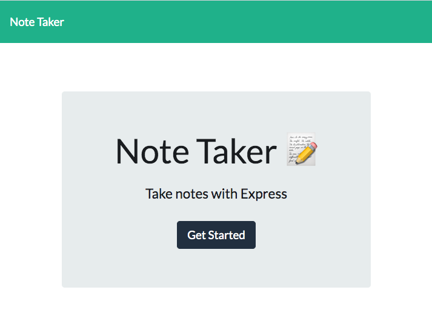
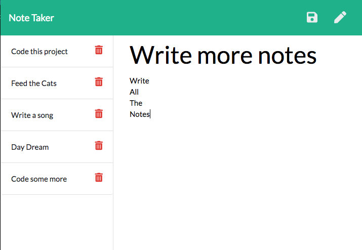

# Note Taker

   

## Heroku Link
### 👇Click the badge to check out the deployed Heroku page! 

## Description 

Creating a back-end server database solution using express.js and node.js to connect to an existing front client code base.

## Table of Contents
* [Screenshots](#Screenshots)
* [Credits](#credits)
* [Questions](#Questions)

## Screenshots

## Credits

* Anders Ackerman
* My Three Cats!

## Questions

If anybody has any questions please reach out to the creator of the project - Anders Ackerman via:
* Email: anders.swedishviking@gmail.com
* GitHub: (https://github.com/dj-viking)
